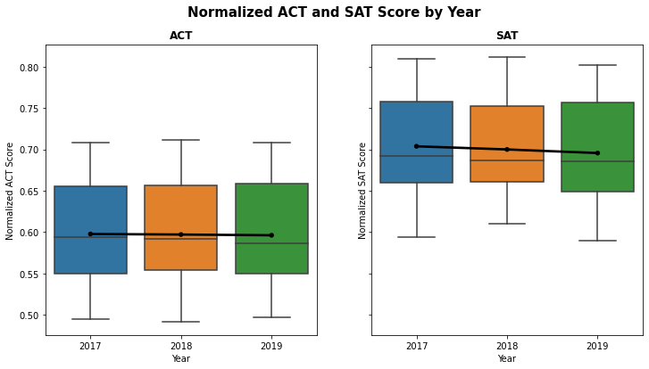

{
 "cells": [
  {
   "cell_type": "markdown",
   "id": "5247894e",
   "metadata": {},
   "source": [
    "### Content\n",
    "- [Background](#Background)\n",
    "- [Problem Statement](#Problem-Statement)\n",
    "- [Data Dictionary](#Data-Dictionary)\n",
    "- [Summary of Analysis](#Summary-of-Analysis)\n",
    "- [Conclusions](#Conclusions)\n",
    "- [Recommendations](#Recommendations)\n",
    "\n",
    "\n",
    "### Background\n",
    "The SAT and ACT are standardized tests that many colleges and universities in the United States require for their admissions process. This score is used along with other materials such as grade point average (GPA) and essay responses to determine whether or not a potential student will be accepted to the university.\n",
    "\n",
    " \n",
    "\n",
    "The SAT has 2 compulsory sections which cover the following content and skills ([*source*](https://www.studypoint.com/ed/the-sat/)) and the total score is the sum of the sections scores ([*source*](https://collegereadiness.collegeboard.org/sat/scores/understanding-scores/interpreting)).\n",
    "\n",
    "|Section|Content & Skills|Section Score|\n",
    "|:---|:---|:---:|\n",
    "|Evidence-Based Reading and Writing|Reading - Reading and vocabulary in context Writing - Grammer and usage|200 - 800|\n",
    "|Math|Heart of algebra Problem solving Data analysis Passport to advanced math Additional topics (geometry, trigonometry and pre-calculus)|200 - 800|\n",
    "\n",
    " \n",
    "\n",
    "\n",
    "The ACT on the other hand has 4 compulsory sections convering the following content and skills ([*source*](https://www.studypoint.com/ed/the-act-test/)) and the composite score is the average of the 4 compulsory sections ([*source*](https://blog.prepscholar.com/how-is-the-act-scored)).\n",
    "\n",
    "\n",
    "|Section|Content & Skills|Section Score|\n",
    "|:---|:---|:---:|\n",
    "|English|Grammar & usage Punctuation Sentence structure Strategy Organization Style|1 - 36|\n",
    "|Reading|Reading comprehension of what is directly stated or implied|1 - 36|\n",
    "|Math|Pre-algebra Elementary algebra Intermediate algebra Coordinate geometry Plane geometry Trigonometry|1 - 36|\n",
    "|Science|Interpretation Analysis Evaluation Reasoning Problem solving|1 - 36|\n",
    "\n",
    " \n",
    "\n",
    "Note: Both SAT and ACT have optional essay/writing which is not mentioned above.\n",
    "\n",
    " \n",
    "\n",
    "However in 2016, SAT underwent a major restructuring in its format and scoring system ([*source*](https://www.studypoint.com/ed/sat-history/)). Few examples of the changes made are:-\n",
    "- Decrease number of sections from 3 to 2\n",
    "    - Combined reading and writing into one section called “Evidence-Based Reading and Writing”\n",
    "- Total maximum score is decreased from 2400 to 1600\n",
    "- No penalty for guessing the answer\n",
    "\n",
    " \n",
    "\n",
    "### Problem Statement\n",
    "With the SAT major restructing in its format and scoring system in 2016, the ACT management team are concerned that the ACT participation rate and reputation might have been negatively affected. Being an analyst working in ACT, you are tasked by your supervisor to conduct a study to find out the following and make recommendations based on your findings:-\n",
    "\n",
    "- How has the ACT and SAT participation rate changed between 2017 to 2019?\n",
    "- Which states are pro ACT or SAT?\n",
    "- Are students scoring higher for SAT compared to ACT?\n",
    "\n",
    " \n",
    "\n",
    "### Data Dictionary\n",
    "Below are the data dictionary of the features used in the analysis.\n",
    "\n",
    "|Feature|Type|Dataset|Description|\n",
    "|---|---|---|---|\n",
    "|state|object|act_2017 act_2018 act_2019|Name of state where the data is collected from|\n",
    "|participation_act|float|act_2017 act_2018 act_2019|State participation rate in ACT|\n",
    "|composite|float|act_2017 act_2018 act_2019|ACT composite score|\n",
    "|year|int|act_2017 act_2018 act_2019|Year which the test was held|\n",
    "|participation_sat|float|sat_2017 sat_2018 sat_2019|State participation rate in SAT|\n",
    "|ebrw_sat|int|sat_2017 sat_2018 sat_2019|Score from evidence based reading  and writing component of SAT|\n",
    "|math_sat|int|sat_2017 sat_2018 sat_2019|Score from math component of SAT|\n",
    "|total_sat|int|sat_2017 sat_2018 sat_2019|SAT Total Score|\n",
    "|composite_act_normalized|float|Derived from composite_act|Normalised score of ACT|\n",
    "|total_sat_normalized|float|Derived from total_sat|Normalised score of SAT|\n",
    "|avg_score|float|Derived from  composite_act_normalized   & total_sat_normalized|Average normalised score of ACT and SAT|\n",
    "\n",
    " \n",
    "\n",
    "### Summary of Analysis\n",
    "\n",
    "#### How has the ACT and SAT participation rate changed between 2017 to 2019?\n",
    "\n",
    "The ACT participation rate had decreased by ~8% from 2017 to 2019 while SAT participation rate had increased by ~10% during the same period. However, during these 3 years, both ACT and SAT were seeing a larger spread in their participation rates where ACT were seeing more states with lower participation rate, whereas SAT were seeing more states with higher participation rate.\n",
    "\n",
    "\n",
    " \n",
    " \n",
    "\n",
    "During the 3 years, 18 states had very high ACT participation rate (greater than 90%) as compared to 10 states for SAT. For the majority of the remaining states, they did not show overwhelming bias for either of the tests.\n",
    "\n",
    "\n",
    " \n",
    " \n",
    "\n",
    "#### Which states are pro ACT or SAT?\n",
    "\n",
    "ACT has 13 states with average of 100% participation rate from 2017 to 2019. Example of the top 5 states with 100% participation rate are Alabama, Kentucky, Wisconsin, Utah and Tennessee.\n",
    "\n",
    " \n",
    " \n",
    "\n",
    "\n",
    "SAT only had 3 states with average of 100% participation rate from 2017 to 2019. Example of the top 5 states are Michigan, Connecticut and Delaware with 100% participation rate followed by Idaho and Maine with average of 97% participation rate.\n",
    "\n",
    " \n",
    " \n",
    "\n",
    "#### Are students scoring higher for SAT compared to ACT?\n",
    "As it is not possible to directly compare ACT score to SAT, both ACT and SAT scores were normalized by dividing the scores with their maximum possible score (36 for ACT and 1600 for SAT). For example, ACT score of 20 would be 0.55 after normalization while SAT score of 1400 would be 0.875 where 1 is the full score in both instances.\n",
    " \n",
    " \n",
    "\n",
    "In all 3 years, the normalized scores for ACT and SAT have remained fairly stable where SAT has higher normalized score than ACT (ACT: ~0.6 vs SAT: ~0.7).\n",
    " \n",
    " \n",
    "\n",
    "Comparing ACT and SAT normalized score trend across the 3 years, most states' ACT and SAT score have remained fairly stable. Among the 51 states, only less than 10 states have ACT score consistently higher than SAT score.\n",
    "\n",
    " \n",
    " \n",
    "\n",
    "#### Are student scoring less due to higher average participation rate?\n",
    "|ACT Score vs Participation Rate|SAT Score vs Participation Rate|\n",
    "|:---:|:---:|\n",
    "|||\n",
    "\n",
    "From the graphs above, there is an inverse correlation between state average score vs state average participation rate. As participation rate increases, the score tends to decrease. This is probably because more academically average or poor students attended these tests, which increased the average participation rate but pulled down the average score as they are more likely to score lower during these tests.\n",
    "\n",
    "\n",
    "### Conclusions\n",
    "In summary, with the change in SAT format in 2016, ACT was adversely affected as their yearly average participation rate had decline from 2017 to 2019. This is evident as some states had clearly opted for SAT over ACT given the sharp decline in ACT participation rate in 4 states, namely Colorado, Illinois, South Carolina and West Virginia. However, despite the declining participation rate, ACT still had overwhelming support from more states as compared to SAT.\n",
    "\n",
    "On the other hand, when comparing the normalized scores of ACT and SAT, it is evident that students were scoring less points on ACT as compared to SAT.\n",
    "\n",
    "\n",
    "\n",
    "### Recommendations\n"
   ]
  },
  {
   "cell_type": "code",
   "execution_count": null,
   "id": "3d83ad09",
   "metadata": {},
   "outputs": [],
   "source": []
  }
 ],
 "metadata": {
  "kernelspec": {
   "display_name": "Python 3",
   "language": "python",
   "name": "python3"
  },
  "language_info": {
   "codemirror_mode": {
    "name": "ipython",
    "version": 3
   },
   "file_extension": ".py",
   "mimetype": "text/x-python",
   "name": "python",
   "nbconvert_exporter": "python",
   "pygments_lexer": "ipython3",
   "version": "3.8.8"
  }
 },
 "nbformat": 4,
 "nbformat_minor": 5
}
